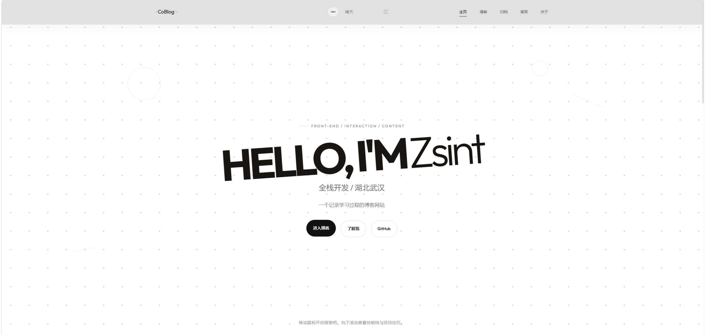
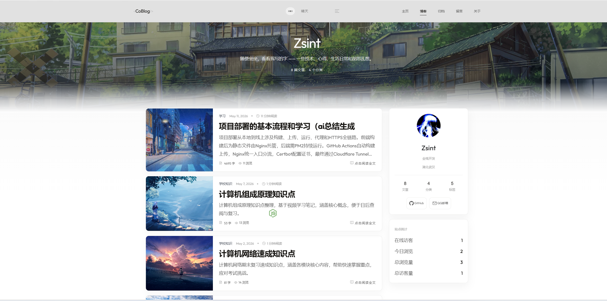
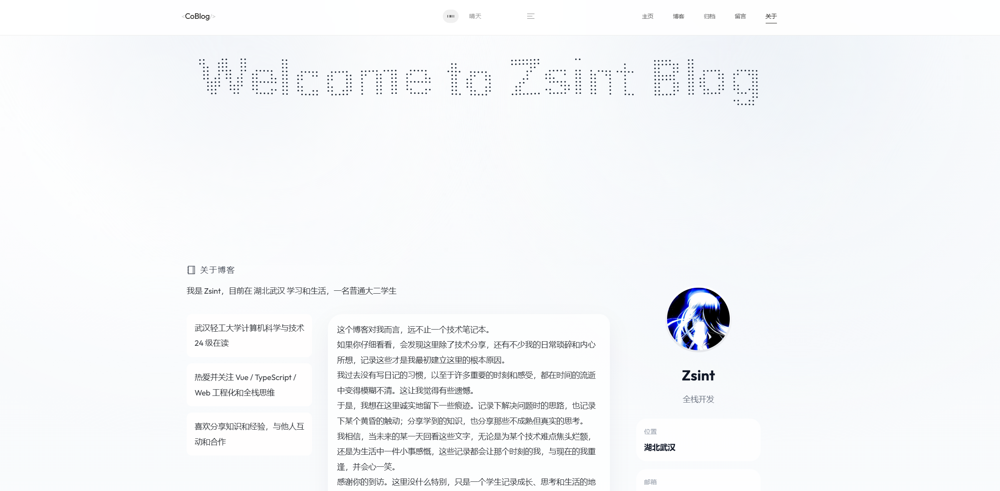
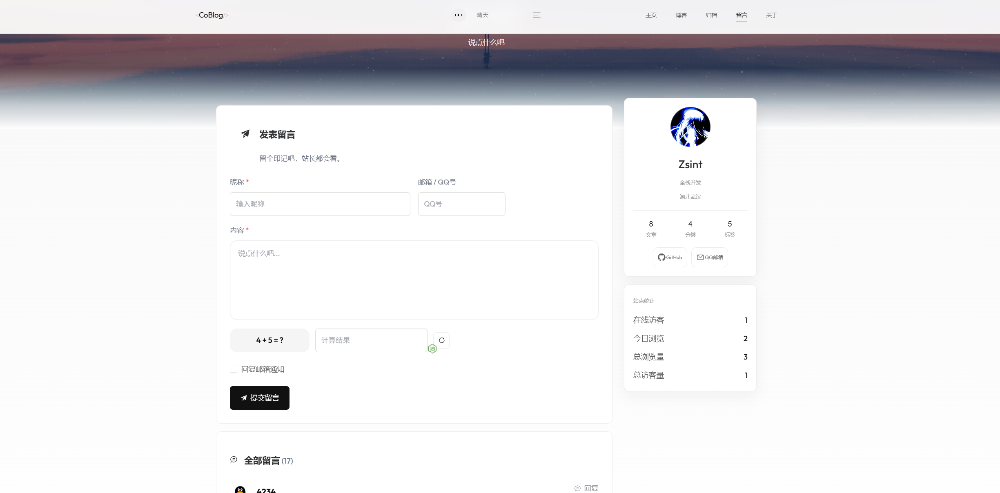
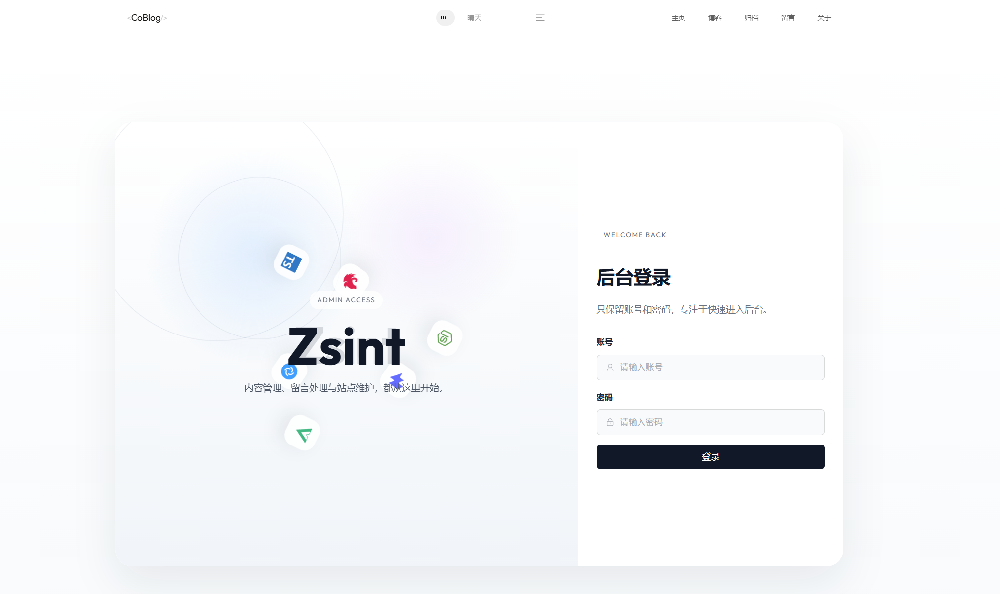
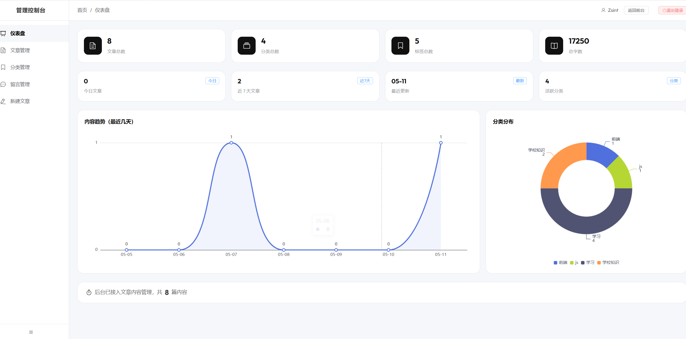
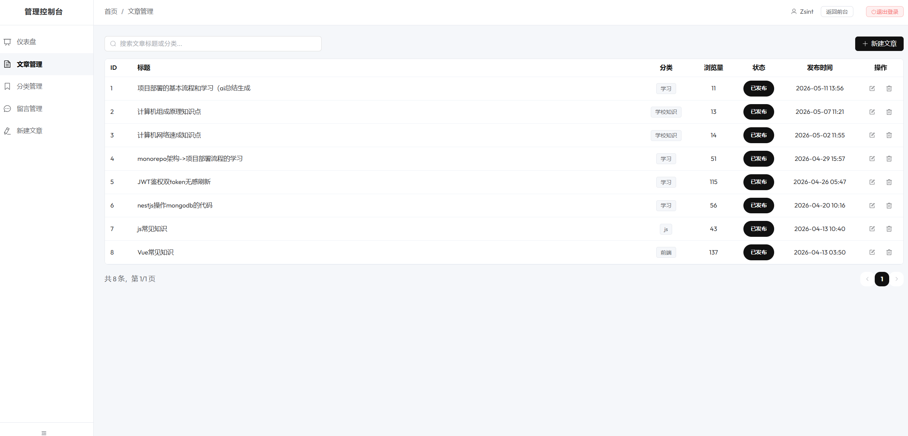
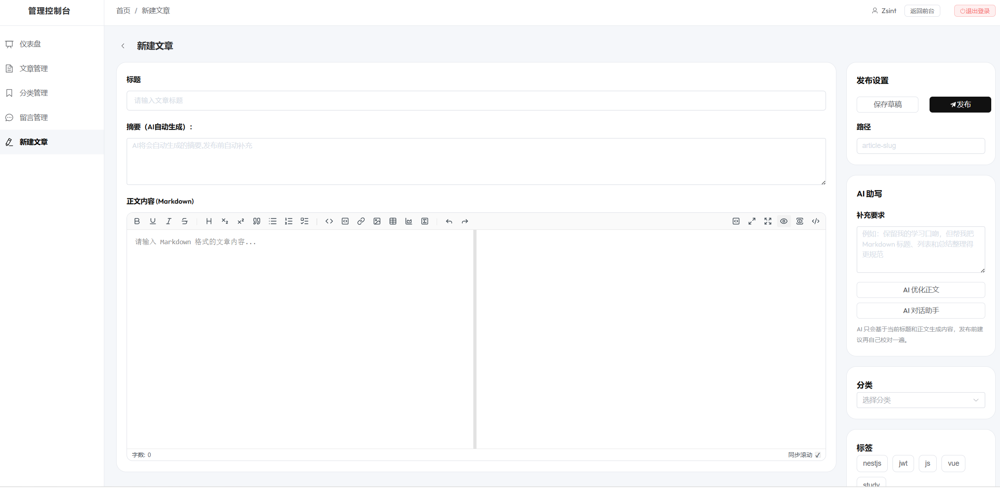

# CoBlog


CoBlog 是一个基于 `Vue 3 + NestJS + MongoDB` 的个人全栈博客系统，包含前台内容站点、后台管理端、文章管理、分类标签、留言互动、访客统计、图片上传以及 AI 写作助手能力。项目采用前后端双应用结构，适合作为个人博客、作品集项目或全栈项目实践参考。

## 在线演示

- 站点首页：`https://coblog.top/`
- 关于页面：`https://coblog.top/about`
- 接口示例：`https://coblog.top/visits/stats`

## 效果预览

详细效果可查看 `screen-*` 文件夹，下面是部分页面展示。

### 前台页面

<p align="center">
  
  
</p>

<p align="center">
  
  
</p>

### 后台页面

<p align="center">
  
  
</p>

<p align="center">
  
  
</p>

## 功能特色

### 前台站点

- 文章列表、文章详情、分类、标签、归档完整浏览流程
- Markdown 内容渲染与文章阅读体验优化
- 留言板与站点互动功能
- 关于页与个人信息展示
- 首页视觉动画、技术图标、交互式展示
- 响应式布局，兼顾桌面端与移动端浏览

### 后台管理

- 后台登录鉴权
- 文章新建、编辑、发布与管理
- 分类与标签管理
- 留言审核、回复与处理
- 访客统计与基础看板展示
- 图片上传与内容管理支持

### 编辑与 AI 写作能力

- 集成 `md-editor-v3`，支持 Markdown 编辑与实时预览
- 支持图片上传、草稿自动保存和文章摘要管理
- 接入 DeepSeek Chat Completions API
- 支持标题生成、摘要生成、文章润色、Markdown 结构优化、根据大纲续写、标签和分类建议
- AI 写作结果可在编辑器中预览，并支持采纳、替换、追加或拒绝

### 工程与安全

- 前后端独立依赖管理，根目录只负责协调启动和构建
- NestJS 接口参数校验、JWT 鉴权、httpOnly Cookie 会话保护
- Redis 滑动窗口限流，覆盖登录、留言、上传、访客统计和 AI 写作接口
- 图片上传包含 MIME 类型和文件魔数校验
- SSE 用于留言消息推送和 AI 写作流式输出，前端通过 EventSource 建立实时连接
- 分类和标签删除带引用保护，避免误删仍被文章使用的数据

<br />

# 第三方接口声明

本项目部分能力依赖第三方接口，包括 AI 写作、访客位置查询、博客页面图片生成等。详细说明可查看：

- 详细说明文档：[`API-detail/README.md`](./API-detail/README.md)

<br />

## 技术栈

- 前端：`Vue 3`、`TypeScript`、`Vite`、`Vue Router`、`Pinia`、`Element Plus`、`UnoCSS`、`Sass`
- 后端：`NestJS`、`MongoDB`、`Mongoose`、`JWT`、`Redis`、`SSE`、`Multer`
- 内容与可视化：`md-editor-v3`、`ECharts`、`GSAP`、`Three.js`
- AI 能力：`DeepSeek Chat Completions API`
- 工程工具：`pnpm`、`ESLint`、`Prettier`、`TypeScript`

## 技术架构

```text
┌──────────────────────────────────────────────┐
│              Nginx / Vite                    │
│      Static Assets + SPA Route Fallback      │
└───────────────────────┬──────────────────────┘
                        │ /api
                        ▼
              ┌───────────────────┐
              │   NestJS Server   │
              │   apps/server     │
              └─────────┬─────────┘
                        │
          ┌─────────────┴─────────────┐
          ▼                           ▼
     ┌──────────┐                ┌──────────┐
     │ MongoDB  │                │  Redis   │
     └──────────┘                └──────────┘
```

前端 `apps/client` 和后端 `apps/server` 独立管理依赖，根目录只通过 `pnpm --dir` 脚本协调开发、构建和安装流程。

## 项目结构

```text
CoBlog/
├─ apps/
│  ├─ client/                    # Vue 前台站点与后台页面
│  │  ├─ public/                 # 静态资源
│  │  └─ src/                    # 页面、组件、路由、请求、样式
│  └─ server/                    # NestJS 后端服务
│     └─ src/                    # controller / service / module / dto / schema
├─ deploy/
│  └─ nginx/                     # Nginx 配置参考
├─ docs/                         # 项目文档
├─ package.json                  # 根目录协调脚本
└─ README.md
```

## 快速开始

### 环境要求

| 环境 | 版本要求 |
| --- | --- |
| Node.js | `>= 20` |
| pnpm | `>= 10` |
| MongoDB | 本地或远程可用实例 |
| Redis | 本地或远程可用实例 |

### 1. 克隆项目

```bash
git clone https://github.com/zsh260439/CoBlog.git
cd CoBlog
```

### 2. 安装依赖

```bash
pnpm setup
```

### 3. 配置环境变量

后端配置统一放在仓库根目录 `.env`。可以复制 `.env.example`：

```bash
cp .env.example .env
```

后端最小示例：

```env
PORT=3000
MONGODB_URI=mongodb://127.0.0.1:27017/coblog
REDIS_URL=redis://127.0.0.1:6379
JWT_SECRET=your_jwt_secret
JWT_EXPIRES_IN=1d
JWT_REFRESH_SECRET=your_jwt_refresh_secret
INIT_ADMIN_USERNAME=admin
INIT_ADMIN_PASSWORD=123456

DEEPSEEK_API_KEY=your_deepseek_api_key
DEEPSEEK_API_URL=https://api.deepseek.com/chat/completions
DEEPSEEK_MODEL=deepseek-v4-flash

MAIL_HOST=smtp.qq.com
MAIL_PORT=465
MAIL_SECURE=true
MAIL_USER=your_mail_account@qq.com
MAIL_PASS=your_smtp_authorization_code
MAIL_FROM=your_mail_account@qq.com
```

前端开发环境变量放在 `apps/client/.env.development.local`，例如：

```env
VITE_API_BASE_URL=http://localhost:3000
```

### 4. 启动开发环境

```bash
pnpm dev
```

也可以分别启动：

```bash
pnpm dev:server
pnpm dev:client
```

首次启动时，如果 `login` 集合为空，并且环境变量中提供了 `INIT_ADMIN_USERNAME` 和 `INIT_ADMIN_PASSWORD`，后端会自动创建一个管理员账号。创建完成后，后续重启不会重复覆盖已有管理员数据。

如果需要在站长回复留言后给访客发送提醒邮件，还需要配置 `MAIL_*` 这组 SMTP 变量。只有当访客留言时填写了邮箱，并勾选邮箱通知后，系统才会在站长回复时发送通知。

默认访问地址：

- 前端：`http://localhost:5173`
- 后端：`http://localhost:3000`

## 常用命令

```bash
pnpm setup          # 安装前后端依赖
pnpm dev            # 并行启动前后端开发服务
pnpm dev:client     # 仅启动前端
pnpm dev:server     # 仅启动后端

pnpm build          # 构建前后端
pnpm build:client   # 构建前端
pnpm build:server   # 构建后端
```

## 核心模块说明

### 前台内容站点

- 首页内容展示
- 文章阅读页
- 分类、标签、归档导航
- 留言页与互动功能
- 关于页内容展示

### 后台管理端

- 登录鉴权与后台入口
- 文章编辑与发布
- 分类标签管理
- 留言审核与处理
- 站点访问统计
- AI 写作助手

### 管理员初始化

- 当前项目不提供公开注册入口。
- 当数据库中的 `login` 集合为空时，系统会尝试从环境变量读取：
  - `INIT_ADMIN_USERNAME`
  - `INIT_ADMIN_PASSWORD`
- 如果这两个值存在，后端启动时会自动创建第一条管理员账号。
- 一旦数据库中已经存在登录账号，后续重启不会重复创建，也不会覆盖原有管理员数据。

## 生产部署说明

当前项目仓库内保留了实际可用的部署参考文件：

- GitHub Actions：`.github/workflows/deploy.yml`
- Nginx 配置参考：`deploy/nginx/coblog.conf`

项目当前生产部署思路：

1. 通过 GitHub Actions 在 push 到 `main` 后触发构建
2. 上传前端 `dist` 与后端 `dist` 到服务器
3. 远端使用 `pnpm` 安装服务端生产依赖
4. 使用 `pm2` 管理后端进程
5. 使用 `nginx` 提供静态资源与反向代理

### 前端构建

```bash
pnpm build:client
```

构建产物位于：

```text
apps/client/dist
```

### 后端构建

```bash
pnpm build:server
```

构建产物位于：

```text
apps/server/dist
```

### Nginx 配置参考

可以参考仓库中的 `deploy/nginx/coblog.conf`。典型思路如下：

```nginx
server {
    listen 80;
    server_name your-domain.com;
    root /path/to/apps/client/dist;
    index index.html;

    location / {
        try_files $uri $uri/ /index.html;
    }

    location /api/ {
        proxy_pass http://127.0.0.1:3000/;
        proxy_set_header Host $host;
        proxy_set_header X-Real-IP $remote_addr;
        proxy_set_header X-Forwarded-For $proxy_add_x_forwarded_for;
    }
}
```

## 二次使用前建议修改的内容

如果想把这个项目作为自己的博客或个人站点继续改造，建议优先检查：

- 站点名称与个人信息
- 域名与 API 地址
- 社交链接与关于页文案
- 默认图片、图标与静态资源
- 环境变量配置
- Nginx 域名与部署路径
- GitHub Actions 中的服务器地址与部署目录

## 开源协作

欢迎通过 `Issue` 或 `Pull Request` 参与改进：

- Bug 修复
- 功能增强
- 文档完善
- 性能优化

如果你是第一次参与开源协作，建议先从文档和小功能优化入手。

## License

当前仓库中的服务端 `package.json` 标记为 `UNLICENSED`。如果后续需要公开分发或作为可复用模板，建议再单独补充明确的开源协议文件与授权说明。
