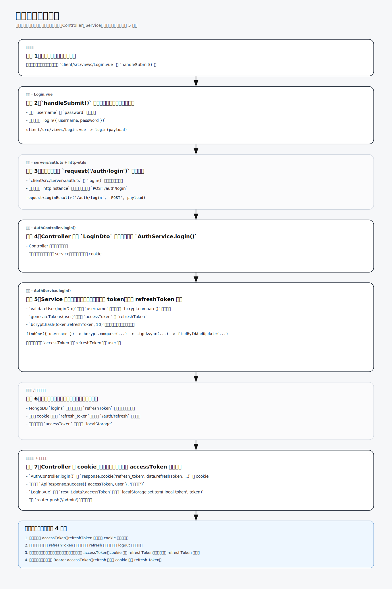
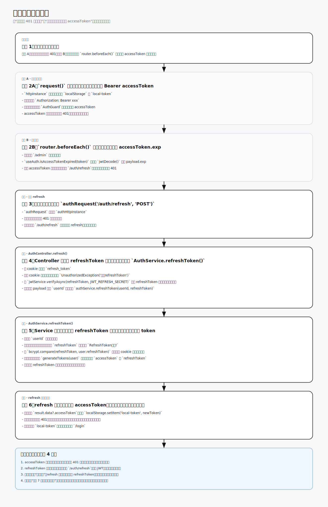
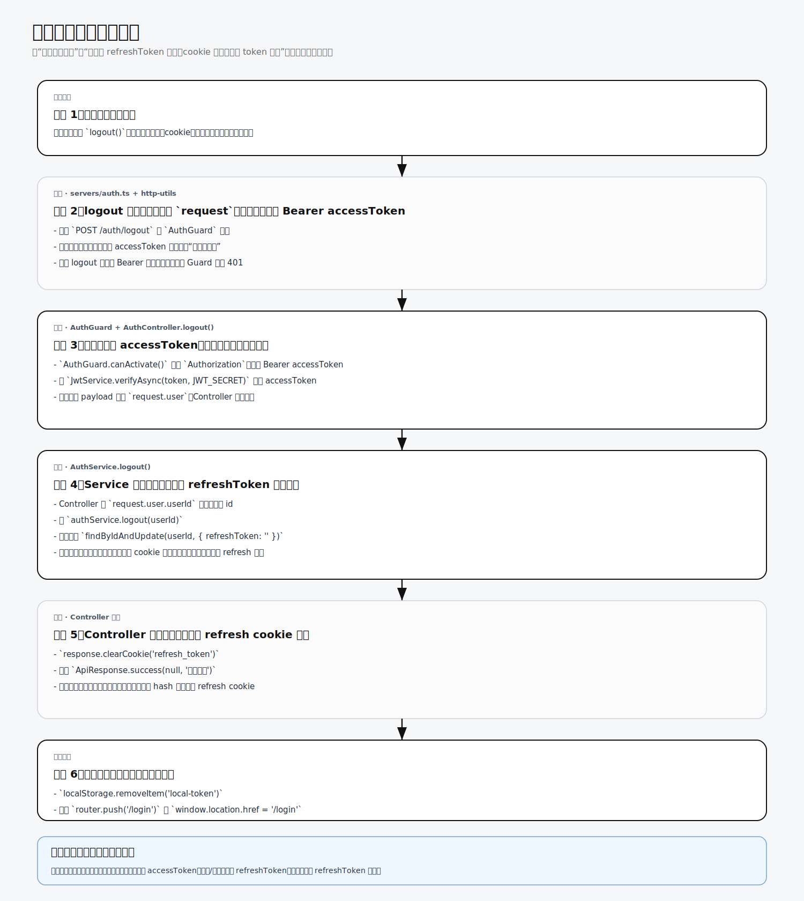

# 双 Token 认证流程笔记

> 本笔记基于 CoBlog 项目的实际实现整理，用于记录双 Token 认证的核心原理与实战经验。
>
> 配图来源：`auth-review/` 目录下的流程图

***

## 为什么需要双 Token？

### 单 Token 的问题

传统流程是这样的：

1. 前端登录，后端返回一个 token
2. 前端存到 localStorage（或者内存）
3. 每次请求带上这个 token

**问题在哪？**

token 一旦被恶意获取，攻击者就能一直用，因为没有过期机制（或者过期时间很长）。而且 token 存在 localStorage 的话，容易被 XSS 攻击偷走。

### 双 Token 怎么解决的

搞两个 token：

- **短 Token（accessToken）**：操作数据的通行证，过期时间短（比如 20 分钟）
- **长 Token（refreshToken）**：用于刷新短 token，过期时间长（比如 1 天），存在 HttpOnly Cookie 里

这样就算短 token 被偷了，攻击者也只能用 20 分钟；但长 token 存在 Cookie 且是 httpOnly，JS 拿不到，XSS 也没戏。

***

## 登录流程



**简化版流程：**

```
1. 用户输入账号密码，前端提交
2. 后端查库验证用户
3. bcrypt 比对密码
4. 生成 accessToken + refreshToken
5. refreshToken 哈希存数据库
6. accessToken 返回给前端
7. refreshToken 写入 HttpOnly Cookie
```

***

## 两种常见的场景

### 场景 1：短 token 失效，长 token 还在

这个是最常见的情况，流程如下：

```
1. 前端带着 accessToken 发送请求
2. 后端一验证，发现 accessToken 过期了，返回 401
3. 前端响应拦截器捕获 401，知道 token 过期了
4. 用 authRequest 发送刷新请求（带上 Cookie，里面的 refreshToken）
5. 后端拿到 refreshToken 验证，对比数据库里的哈希
6. 对上了，返回新的 accessToken + refreshToken
7. 前端存新的 accessToken，用这个 token 重试刚才失败的请求
```

**重点：** 刷新的时候返回的其实是两个 token，因为 refreshToken 本身也刷新了（rotation 机制，防止被复用）。

### 场景 2：短 token 失效，长 token 也失效

这种情况就是"真正的登录过期"了：

```
1. 前端带着 accessToken 发送请求
2. 后端返回 401
3. 响应拦截器捕获 401，尝试刷新
4. 用 authRequest 发送刷新请求（带上 Cookie）
5. 但 refreshToken 也过期了，后端返回 401
6. authRequest 没有响应拦截器，直接报错
7. 跳转到登录页，让用户重新登录
```

**这里必须区分 request 和 authRequest 两个 axios 实例**，否则会出事。

***

## 为什么要区分 request 和 authRequest？

这是踩坑得出的结论。

### 问题：无限循环死锁

假设只有一套 axios 实例（就叫 request 吧）：

```
1. 带着 accessToken 发请求，accessToken 过期，返回 401
2. 进入响应拦截器，用 request 发送刷新请求（因为只有这一套）
3. 但 refreshToken 也过期了，刷新请求也返回 401
4. 这个 401 又进入响应拦截器，又推队列，又尝试刷新...
5. 无限循环，卡死
```

### 解决：两套 axios 实例

| 实例          | 用途           | 有没有响应拦截器      |
| ----------- | ------------ | ------------- |
| request     | 所有业务请求       | 有，捕获 401 尝试刷新 |
| authRequest | 专门用来刷新 token | 没有，失败就直接报错    |

```
1. request 发请求，accessToken 过期，401
2. request 响应拦截器捕获 401
3. 用 authRequest 发刷新请求
4. 如果 refreshToken 有效 → 成功刷新，清空队列
5. 如果 refreshToken 也失效 → authRequest 直接报错，不会再进拦截器
6. 直接跳转登录页，不会死循环
```

***

## 刷新流程



**刷新 token 的两种触发入口：**

1. **业务请求 401**：accessToken 过期了，后端返回 401，前端拦截器捕获到，尝试刷新
2. **切路由主动检测**：每次进后台页面之前，前端主动检查 accessToken 是否快过期了，提前刷新

***

## 路由切换时的 token 检测

切换路由的时候也可能会触发 token 过期检测，这里用的是路由前置守卫（router.beforeEach）：

```
1. 用户切换路由
2. 路由守卫检测 accessToken 是否过期
3. 过期了？用 authRequest 发送刷新请求（不要用 request，会死循环）
4. 刷新成功 → 继续导航
5. 刷新失败（refreshToken 也挂了）→ 跳转登录页
```

***

## 队列机制（requestQueue）

当多个请求同时触发 401 的时候，需要队列机制：

```
1. 假设用户在疯狂刷新页面，同时发了 3 个请求
2. accessToken 过期了，3 个请求都返回 401
3. 第一个请求进入刷新逻辑（isRefreshing = true）
4. 后面两个请求发现正在刷新，进入队列等着
5. 刷新成功了，从队列里拿出请求，带着新 token 重新发
```

**注意：** 刷新请求必须用 authRequest，不能用 request，否则：

- 如果队列里有刷新请求本身，又会触发刷新
- 刷新请求返回 401，又进拦截器，又推队列
- 又刷新...死循环

***

## 退出登录流程



```
1. 用户点退出按钮
2. 调 /auth/logout（带 Bearer accessToken）
3. AuthGuard 先验证 accessToken 是否有效
4. 后端清数据库里的 refreshToken 哈希
5. 后端 clearCookie('refresh_token')
6. 前端清 localStorage 里的 accessToken
7. 跳转到登录页
```

***

## Cookie vs localStorage 存 token

| 存储位置            | 优点              | 缺点           |
| --------------- | --------------- | ------------ |
| localStorage    | 随时访问，方便         | 容易被 XSS 攻击偷走 |
| HttpOnly Cookie | JS 访问不到，XSS 拿不到 | 需要配合 CSRF 防护 |

**refreshToken 必须存 Cookie 而且要 httpOnly**，这是最后的防线。

**accessToken 可以存内存（变量里）**，页面刷新就没了，但刷新页面的时候本来就要重新获取 token，影响不大。也可以存 localStorage，但要有 XSS 防护心理准备。

***

## 项目中两套 axios 实例的配置

```typescript
// request - 业务请求用，有 401 拦截器自动刷新
const httpInstance = axios.create({ ... })
httpInstance.interceptors.response.use(
  (res) => res.data,
  async (error) => {
    // 401 → authRequest 刷新 → 成功重试，失败跳转登录
  }
)

// authRequest - 专用来刷 token，没有拦截器，不会死循环
const authHttpInstance = axios.create({ ... })
authHttpInstance.interceptors.response.use(
  (res) => res.data,
  (error) => Promise.reject(error)  // 直接抛错，不处理
)
```

***

## 总结

1. **双 token 就是为了安全**：短 token 频繁更换，泄露了也只能用一小会儿；长 token 藏 Cookie 里，JS 拿不到
2. **必须两套 axios 实例**：业务请求用 request（有拦截器），刷新用 authRequest（没有），否则会死循环
3. **refreshToken 要 rotation**：每次刷新都换新的，防止被盗后被 reuse
4. **Cookie 要 httpOnly + sameSite**：防止 XSS 和 CSRF
5. **队列机制**：多个请求同时 401 时，只有第一个去刷新，其他的排队等着

***

## 相关文档

- [登录鉴权复习总览](auth-review/AUTH-REVIEW.md)
- [登录流程详解](auth-review/LOGIN-FLOW.md)
- [刷新流程详解](auth-review/REFRESH-FLOW.md)
- [退出登录流程详解](auth-review/LOGOUT-FLOW.md)

***

*笔记整理时间：2026-04-25*
